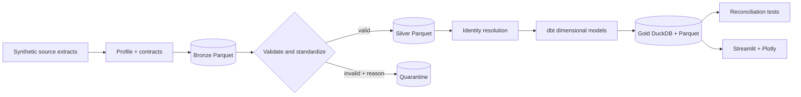

# FieldForge

> Work in progress: this is a learning and implementation checkpoint, not a verified release. See ASTRA_WORKLOG.md for remaining work and the resume point.

FieldForge is a zero-cost customer data onboarding platform built around a fictional subscription-commerce implementation for **Northstar Commerce**. It turns messy CRM, billing, order, and support extracts into a governed local lakehouse, reconciled KPIs, and a traceable Streamlit dashboard.

## Why this project exists

The repository demonstrates the work expected of a Data Engineer, Analytics Engineer, AI & Data Consultant, or Forward Deployed Engineer: discovery, data contracts, profiling, validation, quarantine, identity resolution, dimensional modelling, KPI governance, delivery automation, and customer handover.

## Quick start

Requirements: Python 3.11–3.13 and `make`. No cloud account, secrets, or paid API is required.

```bash
make setup
make all
make dashboard
```

Or with Docker:

```bash
docker compose run --rm fieldforge make all
docker compose up dashboard
```

The pipeline is deterministic. Outputs are written to `data/` and `artifacts/`, both ignored by Git.

## Commands

| Command | Purpose |
|---|---|
| `make setup` | Create `.venv` and install locked project dependencies |
| `make pipeline` | Generate → profile → bronze → silver → gold → reconcile |
| `make test` | Unit/integration tests plus dbt model tests |
| `make all` | Run the pipeline and all tests |
| `make dashboard` | Start the Streamlit KPI application |
| `make spark` | Run the selected optional PySpark equivalent |
| `make benchmark` | Record local pipeline timings |
| `make clean` | Remove only generated local outputs |

## Architecture



See [architecture.md](docs/architecture.md), [data-model.md](docs/data-model.md), and [demo.md](docs/demo.md).

## Repository map

```text
fieldforge/          Python pipeline and shared business rules
dbt/                 DuckDB staging, dimensions, facts, marts, and tests
dashboard/           Streamlit application backed only by verified gold models
spark/               Selected local PySpark transformations
tests/               Contract, quarantine, identity, and reconciliation tests
docs/                Discovery, decisions, diagrams, runbook, and handover
config/              Source contracts and governed KPI definitions
.github/workflows/   Reproducible CI
```

## Definition of done

The release gate is encoded in `make all`: deterministic generation, explicit quarantine, count and revenue reconciliation, referential integrity, governed KPI SQL, dashboard smoke validation, and dbt tests must pass. See [acceptance-criteria.md](docs/acceptance-criteria.md) for the complete checklist. Completion is claimed only when the verification evidence in `ASTRA_WORKLOG.md` is current.

## Data safety

All people, companies, emails, transactions, and tickets are synthetic. The generator plants documented defects deliberately; see `config/planted_errors.yml`. Never use this project’s records as real customer data.

## Portfolio highlights

- Reproducible medallion lakehouse on DuckDB and Parquet with no managed-service dependency.
- Explainable customer identity resolution with durable crosswalks and confidence tiers.
- No-silent-loss validation: every rejected row carries source, rule, reason, and ingest metadata.
- Governed subscription-commerce KPIs with reconciliation tests and SQL-level dashboard traceability.

License: MIT.
