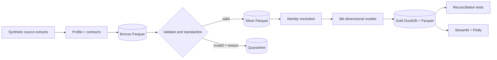

# FieldForge

> Work in progress: this is a learning and implementation checkpoint, not a verified release. See ASTRA_WORKLOG.md for remaining work and the resume point.

FieldForge is a zero-cost customer data onboarding platform built around a fictional subscription-commerce implementation for **Northstar Commerce**. It turns messy CRM, billing, order, and support extracts into a governed local lakehouse, reconciled KPIs, and a traceable Streamlit dashboard.

## Why this project exists

The repository demonstrates the work expected of a Data Engineer, Analytics Engineer, AI & Data Consultant, or Forward Deployed Engineer: discovery, data contracts, profiling, validation, quarantine, identity resolution, dimensional modelling, KPI governance, delivery automation, and customer handover.

## Tools and technology

| Area | Tools | How FieldForge uses them |
|---|---|---|
| Data engineering | Python, pandas, PyArrow, Pandera | Seeded source generation, contracts, profiling, bronze/silver processing, quarantine, and evidence artifacts |
| Analytics engineering | DuckDB, SQL, dbt Core, dbt-duckdb | Staging models, dimensions, facts, marts, lineage, tests, and currency-safe KPI logic |
| Product experience | Streamlit, Plotly | Operational quality console, investigation workflow, governed business views, and SQL Lab |
| Quality and delivery | pytest, Ruff, uv, Make, GitHub Actions | Fully locked dependencies, reproducible orchestration, regression checks, hosted CI, and release-blocking reconciliation |
| Portable execution | Parquet, Docker/Compose, optional PySpark | PySpark order parity is verified on Java 17; Docker image build and the full pipeline are verified in a Linux container |

## Skills demonstrated

| Skill | Evidence in the project |
|---|---|
| Customer data onboarding | Six-source discovery, source contracts, provenance, normalization, and no-silent-loss processing |
| Data quality governance | Rule-coded quarantine, record-level evidence, source-owner requests, chronology controls, and reconciliation |
| Identity resolution | Deterministic exact-email crosswalk with unmatched identities retained instead of guessed |
| Dimensional modelling | Customer, plan, product, and date dimensions with revenue and order-line facts at declared grains |
| KPI design | Currency-separated revenue, attribution coverage, subscription health, support health, and order-line integrity |
| Analytical SQL | Joins, window functions, conditional aggregation, grain tests, and traceable dashboard queries |
| Product and consulting delivery | Customer brief, decisions, acceptance criteria, operational UI, demo path, troubleshooting, and handover documentation |

## Progress — updated 11 September 2026

**Current stage:** PySpark parity and Docker execution are verified; the remaining KPI-semantics audit is underway. **Next milestone:** complete independent KPI reconciliations, then finish broader troubleshooting, portfolio presentation, screenshots, and demo rehearsal.

| Milestone | Status | Evidence / next action |
|---|---|---|
| Customer brief, specification, architecture | Drafted | Versioned documents in docs/ |
| Synthetic sources, profiling, bronze/silver/quarantine | Implemented; initial local checks passed | 10,163 generated rows across six sources; 29 quarantined |
| Identity resolution and analytical models | Dimensional coverage complete | 18 dbt models; every source modelled; grains declared on every model; unattributed revenue retained |
| Automated quality checks | Local checks passed; tests isolated and dependencies locked | 103 dbt tests, 23 Python tests, 15 reconciliation controls, 6 dashboard query checks; `uv.lock` resolves the complete environment |
| Dashboard and SQL Lab | Operational prototype | Four dashboard views, revenue coverage, source-aware investigation, order-line integrity, and an interactive SQL Lab |
| Data Quality Overview and visual design | Implemented; locally verified | Source controls, rejection diagnostics, record drill-down, and governance traceability |
| Larger-scale benchmarks | Reproducible local evidence published | 10× processed 102,479 rows; cold 130.938 s and warm 155.108 s; single-host evidence, not a capacity claim |
| Docker, Spark parity, hosted CI | Docker and Spark verified; milestone CI tracked in worklog | PySpark matched all 1,494 accepted order IDs on Java 17; Docker built both Compose images and `make all` passed in a Linux/x86_64 container |
| Public portfolio release | Pending | Complete acceptance criteria and approve public visibility |

### Latest project session

Audited accepted support tickets opened by month and category. Aneesh correctly assigned real ticket `TKT-000459` to September 2025 despite its October resolution. The existing count was correct: 12 accepted account tickets opened in September. Added the missing KPI definition, an accepted-source dbt reconciliation test, an independent Python release control, and explicit opening-month/count labels and caveats. Native SSD `make all` passed 121 dbt nodes, 15 reconciliation controls, 23 Python tests, and six dashboard queries. The scoped live chart check passed. Next: average resolution hours, one learner checkpoint at a time; the [working KPI audit](docs/kpi-audit.md) tracks outstanding coverage and findings.

### Previous session

Audited the active-subscriber month-end boundary using real subscription `SUB-000254`. Aneesh determined that a subscription cancelled on the month-end date remains active for that snapshot and corrected the SQL comparison from `>` to `>=`. Premium March 2026 therefore reconciles at 88 rather than 87. The registry, dbt mart, new dbt reconciliation test, and release reconciliation control now agree; the broader KPI audit remains open.

### Previous session

Installed Docker Desktop with its Linux disk image on the external SSD, keeping the capacity-heavy container store separate from the Mac's constrained internal drive. Aneesh corrected the dependency command to `uv sync --locked --extra dev` after the first container run proved that excluding development tools also excluded `pytest`, which `make all` requires. Both Compose images then built successfully, and the Linux/x86_64 `fieldforge` container passed all 119 dbt nodes, four gold exports, 13 reconciliation controls, 15 Python tests, and six dashboard SQL checks.

### Earlier session

Locked the complete dependency graph with uv after a learner checkpoint distinguished FieldForge's 10 declared direct dependencies from the 85 distributions installed in the working environment. The cross-platform lock resolves 87 packages, including optional environments, and both `make setup` and the Docker image now enforce it with `--locked`. A disposable clean-copy verification proves setup and the full pipeline do not depend on the existing `.venv`, generated data, artifacts, or caches.

### Earlier session

Verified the optional PySpark 4.0.0 order-standardization slice on macOS with Java 17. The job matched the canonical pipeline's 1,494 accepted orders with zero missing or unexpected IDs and now writes durable `artifacts/spark_parity.json` evidence without collecting identifiers into pandas. The Make target binds Spark to FieldForge's Python interpreter, fixing its accidental use of system Python 3.14. Docker is not installed on this host, so execution remains honestly blocked; static inspection found and fixed the image's missing `make` dependency because Compose invokes `make all`.

### Earlier session

Added an isolated benchmark workflow after Aneesh selected the 10× / 5,000-customer profile from the real 500-customer baseline. `make benchmark` refuses the demo roots, records stage timings, row counts, environment, dbt coverage, scoped memory evidence, and archives the prior observation. The measured 10× workload contains 102,479 rows versus 10,163 at 1×; it passed all 119 dbt nodes, 13 reconciliations, and six dashboard checks in both cold and warm observations. The SQL Lab now displays the two latest profiles, while [the benchmark protocol](docs/benchmark.md) records the exact environment, results, and claim boundary.

### Earlier session

Surfaced `mart_order_line_integrity` as a dedicated dashboard view after a learner decision to emphasize the known quarantined-line consequence. The primary callout traces `ORD-0000015` to one retained quarantined line and its USD 90.00 variance; the two unexplained cases remain visible as a secondary source-owner backlog. The dashboard query returns all 1,494 accepted orders at declared order grain, and a Python test pins the three incomplete orders and their evidence status. Repository-owned Streamlit calls now use the supported `width` argument, and live browser QA verified the hierarchy and values.

### Earlier session

Corrected the seeded customer lifecycle chronology after a learner checkpoint established that event timestamps are evidence and the later CRM first-seen value is wrong. The generator now derives each event-bearing customer's `created_at` on or before their earliest subscription, order, or support event; customers without events retain their independent seeded date. A dbt singular test and release reconciliation control both require zero violations, and the SQL Lab exposes the actual one-row-per-customer chronology preview. The SSD `make all` run passed with 101 dbt tests, 13 Python tests, 13 reconciliation controls, and five dashboard checks. Revenue, quarantine, and order-line integrity figures did not move.

### Earlier session

Isolated test outputs from the demo run. `FIELDFORGE_DATA_ROOT` and `FIELDFORGE_ARTIFACTS_ROOT` now decide where a run lands, resolved when a path is used rather than at import, and `dbt/profiles.yml` and `sources.yml` read the same variable through `env_var` with a `data` default. Tests point it at a temporary directory, so `pytest` no longer rewrites source records, evidence artifacts, or the run ID the dashboard reports. Evidence from a passing test run is disposable; a failing run copies its evidence JSON and a failure report to the Git-ignored `artifacts/test-runs/<run-id>/`. A complete run against a separate root also passes, dbt included, which makes parallel and benchmark runs possible without disturbing demo data.

### Dimensional modelling session

Closed the dimensional gap. `order_items` was generated, validated, and quarantined but never modelled; it now flows through `stg_order_items` into `fct_order_item` at order-line grain, joined to a derived `dim_product` and a data-driven `dim_date`. Every model declares its grain, staging models read governed dbt sources instead of raw file paths, and `mart_order_line_integrity` publishes the consequence of quarantining a line: **3 of 1,494 accepted orders** no longer reconcile to their line totals, and **8 of 3,021 accepted lines** belong to a quarantined order and are retained with `order_link_status = 'order_not_accepted'` rather than dropped. Prior marts are unchanged: 5,646 revenue transactions and 31,597,300 net cents, with monthly KPI, subscription, and support outputs identical to the previous run.

### How progress stays current

At each completed project milestone, update this section's date, status, evidence, and next action in the same commit as the work. Append detailed decisions and verification to [ASTRA_WORKLOG.md](ASTRA_WORKLOG.md). This is a maintained progress record, not an automatic percentage-complete estimate.

### Before calling this complete

- [x] Account for financial records excluded by unresolved identities.
- [x] Complete dimensional models with declared grains and key tests.
- [x] Isolate test data so tests never replace the demo run.
- [x] Lock the full dependency environment.
- [x] Correct synthetic customer chronology and enforce it in dbt and reconciliation.
- [ ] Audit remaining KPI semantics and independent reconciliation.
- [x] Validate dashboard values and visuals against the completed models.
- [x] Verify PySpark parity on Java 17.
- [x] Verify Docker and clean-clone setup.
- [x] Keep hosted CI green for the latest milestone.
- [x] Publish reproducible local scale benchmarks with explicit claim boundaries.
- [x] Finish customer handover for the known quarantined-line case with a learner-authored operator action.

Learning is a release gate, not a side activity. Each major tool or workflow requires a concrete learner attempt on real project evidence—such as writing or correcting SQL, predicting a result, diagnosing a failed control, selecting a grain/test with justification, or editing a small configuration—before the milestone closes. Approval or delegation alone does not count. The exact binding protocol lives in [CLAUDE.md](CLAUDE.md).

If another coding agent must continue this exact local project, start with [CLAUDE.md](CLAUDE.md), then read this README and [ASTRA_WORKLOG.md](ASTRA_WORKLOG.md).

## Quick start

Requirements: `uv`, `make`, and internet access for initial dependency downloads. Setup provisions Python 3.13 locally. No cloud account, secrets, or paid API is required.

```bash
make setup
make all
make dashboard
```

SQL practice workspace after running the pipeline:

```bash
.venv/bin/streamlit run dashboard/sql_lab.py --server.port 8502
```

Source generation is seeded. Outputs are written to `data/` and `artifacts/`, both ignored by Git. Docker/Compose builds and the full container pipeline are verified on Docker Desktop 4.90.0 with Engine 29.7.2 using Linux/x86_64 containers.

## Commands

| Command | Purpose |
|---|---|
| `make setup` | Create `.venv` and install the locked project plus development dependencies |
| `make pipeline` | Generate → profile → bronze → silver → gold → reconcile |
| `make test` | Python tests and dashboard query smoke check |
| `make all` | Run the pipeline and all tests |
| `make dashboard` | Start the Streamlit KPI application |
| `make spark` | Run the optional PySpark order parity check (requires the `spark` extra and Java 17) |
| `make benchmark` | Run the isolated 10× profile and record reproducible evidence |
| `make clean` | Remove only generated local outputs |

## Architecture



See [architecture.md](docs/architecture.md), [data-model.md](docs/data-model.md), and [demo.md](docs/demo.md).

## Repository map

```text
fieldforge/          Python pipeline and shared business rules
dbt/                 DuckDB staging, dimensions, facts, marts, and tests
dashboard/           Streamlit application backed only by verified gold models
spark/               Selected local PySpark transformations
tests/               Contract, quarantine, identity, and reconciliation tests
docs/                Discovery, decisions, diagrams, runbook, and handover
config/              Source contracts and governed KPI definitions
.github/workflows/   Reproducible CI
```

## Definition of done

`make all` exercises the current automated checks; passing it alone does not prove the full release criteria. See [acceptance-criteria.md](docs/acceptance-criteria.md) and the remaining work above. Completion requires current evidence for the entire checklist.

## Data safety

All people, companies, emails, transactions, and tickets are synthetic. The generator plants documented defects deliberately; see `config/planted_errors.yml`. Never use this project’s records as real customer data.

## Portfolio highlights

- Reproducible medallion lakehouse on DuckDB and Parquet with no managed-service dependency.
- Explainable customer identity resolution with durable crosswalks and confidence tiers.
- No-silent-loss validation: every rejected row carries source, rule, reason, and ingest metadata.
- Governed subscription-commerce KPIs with reconciliation tests and SQL-level dashboard traceability.

License: MIT.
