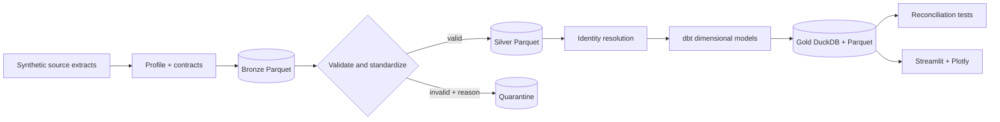

# FieldForge

> Work in progress: this is a learning and implementation checkpoint, not a verified release. See ASTRA_WORKLOG.md for remaining work and the resume point.

FieldForge is a zero-cost customer data onboarding platform built around a fictional subscription-commerce implementation for **Northstar Commerce**. It turns messy CRM, billing, order, and support extracts into a governed local lakehouse, reconciled KPIs, and a traceable Streamlit dashboard.

## Why this project exists

The repository demonstrates the work expected of a Data Engineer, Analytics Engineer, AI & Data Consultant, or Forward Deployed Engineer: discovery, data contracts, profiling, validation, quarantine, identity resolution, dimensional modelling, KPI governance, delivery automation, and customer handover.

## Progress — updated 8 September 2026

**Current stage:** dimensional coverage complete and test runs isolated from the demo run. **Next milestone:** audit synthetic chronology, then validate the dashboard against the completed models.

| Milestone | Status | Evidence / next action |
|---|---|---|
| Customer brief, specification, architecture | Drafted | Versioned documents in docs/ |
| Synthetic sources, profiling, bronze/silver/quarantine | Implemented; initial local checks passed | 10,163 generated rows across six sources; 29 quarantined |
| Identity resolution and analytical models | Dimensional coverage complete | 18 dbt models; every source modelled; grains declared on every model; unattributed revenue retained |
| Automated quality checks | Local checks passed; tests isolated | 100 dbt tests, 13 Python tests, 12 reconciliation controls, 5 dashboard query checks; tests write to a temporary root and never touch the demo run |
| Dashboard and SQL Lab | Operational prototype | Three views, revenue coverage, source-aware investigation, and an interactive SQL Lab |
| Data Quality Overview and visual design | Implemented; locally verified | Source controls, rejection diagnostics, record drill-down, and governance traceability |
| Larger-scale benchmarks | Pending | Initial warm local pipeline baseline: 42.84 seconds; no scale claim yet |
| Docker, Spark parity, hosted CI | Partial | Hosted CI is green on published `main`; Docker and Spark/Java remain unverified |
| Public portfolio release | Pending | Complete acceptance criteria and approve public visibility |

### Latest project session

Isolated test outputs from the demo run. `FIELDFORGE_DATA_ROOT` and `FIELDFORGE_ARTIFACTS_ROOT` now decide where a run lands, resolved when a path is used rather than at import, and `dbt/profiles.yml` and `sources.yml` read the same variable through `env_var` with a `data` default. Tests point it at a temporary directory, so `pytest` no longer rewrites source records, evidence artifacts, or the run ID the dashboard reports. Evidence from a passing test run is disposable; a failing run copies its evidence JSON and a failure report to the Git-ignored `artifacts/test-runs/<run-id>/`. A complete run against a separate root also passes, dbt included, which makes parallel and benchmark runs possible without disturbing demo data.

### Previous session

Closed the dimensional gap. `order_items` was generated, validated, and quarantined but never modelled; it now flows through `stg_order_items` into `fct_order_item` at order-line grain, joined to a derived `dim_product` and a data-driven `dim_date`. Every model declares its grain, staging models read governed dbt sources instead of raw file paths, and `mart_order_line_integrity` publishes the consequence of quarantining a line: **3 of 1,494 accepted orders** no longer reconcile to their line totals, and **8 of 3,021 accepted lines** belong to a quarantined order and are retained with `order_link_status = 'order_not_accepted'` rather than dropped. Prior marts are unchanged: 5,646 revenue transactions and 31,597,300 net cents, with monthly KPI, subscription, and support outputs identical to the previous run.

### How progress stays current

At each completed project milestone, update this section's date, status, evidence, and next action in the same commit as the work. Append detailed decisions and verification to [ASTRA_WORKLOG.md](ASTRA_WORKLOG.md). This is a maintained progress record, not an automatic percentage-complete estimate.

### Before calling this complete

- [x] Account for financial records excluded by unresolved identities.
- [x] Complete dimensional models with declared grains and key tests.
- [x] Isolate test data so tests never replace the demo run.
- [ ] Lock the full dependency environment.
- [ ] Audit synthetic chronology, KPI semantics, and independent reconciliation.
- [ ] Validate dashboard values and visuals against the completed models.
- [ ] Verify Docker, Spark parity, and clean-clone setup; keep hosted CI green.
- [ ] Publish reproducible scale benchmarks and finish customer handover.

Learning follows project milestones: explain the concept, make a useful change, operate it, and verify the outcome. SQL practice supports delivery.

If another coding agent must continue this exact local project, start with [CLAUDE.md](CLAUDE.md), then read this README and [ASTRA_WORKLOG.md](ASTRA_WORKLOG.md).

## Quick start

Requirements: `uv`, `make`, and internet access for initial dependency downloads. Setup provisions Python 3.13 locally. No cloud account, secrets, or paid API is required.

```bash
make setup
make all
make dashboard
```

SQL practice workspace after running the pipeline:

```bash
.venv/bin/streamlit run dashboard/sql_lab.py --server.port 8502
```

Source generation is seeded. Outputs are written to `data/` and `artifacts/`, both ignored by Git. Docker/Compose files are experimental and still require workflow verification.

## Commands

| Command | Purpose |
|---|---|
| `make setup` | Create `.venv` and install pinned direct dependencies (full lock pending) |
| `make pipeline` | Generate → profile → bronze → silver → gold → reconcile |
| `make test` | Python tests and dashboard query smoke check |
| `make all` | Run the pipeline and all tests |
| `make dashboard` | Start the Streamlit KPI application |
| `make spark` | Run the selected optional PySpark equivalent |
| `make benchmark` | Record local pipeline timings |
| `make clean` | Remove only generated local outputs |

## Architecture



See [architecture.md](docs/architecture.md), [data-model.md](docs/data-model.md), and [demo.md](docs/demo.md).

## Repository map

```text
fieldforge/          Python pipeline and shared business rules
dbt/                 DuckDB staging, dimensions, facts, marts, and tests
dashboard/           Streamlit application backed only by verified gold models
spark/               Selected local PySpark transformations
tests/               Contract, quarantine, identity, and reconciliation tests
docs/                Discovery, decisions, diagrams, runbook, and handover
config/              Source contracts and governed KPI definitions
.github/workflows/   Reproducible CI
```

## Definition of done

`make all` exercises the current automated checks; passing it alone does not prove the full release criteria. See [acceptance-criteria.md](docs/acceptance-criteria.md) and the remaining work above. Completion requires current evidence for the entire checklist.

## Data safety

All people, companies, emails, transactions, and tickets are synthetic. The generator plants documented defects deliberately; see `config/planted_errors.yml`. Never use this project’s records as real customer data.

## Portfolio highlights

- Reproducible medallion lakehouse on DuckDB and Parquet with no managed-service dependency.
- Explainable customer identity resolution with durable crosswalks and confidence tiers.
- No-silent-loss validation: every rejected row carries source, rule, reason, and ingest metadata.
- Governed subscription-commerce KPIs with reconciliation tests and SQL-level dashboard traceability.

License: MIT.
