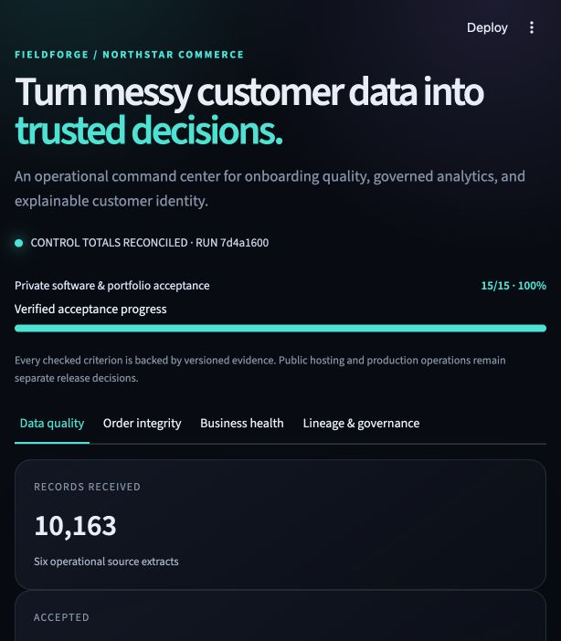
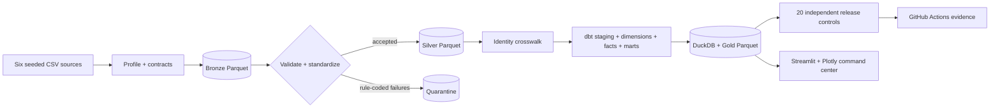
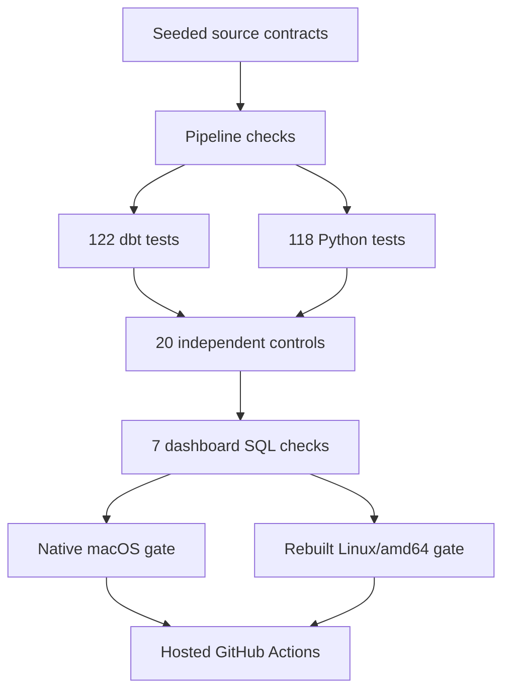

# FieldForge

### A production-minded customer data onboarding platform—built locally, verified end to end, and designed to make bad data impossible to hide.

[](https://github.com/aneeshk-ds/fieldforge/actions/workflows/ci.yml)


FieldForge turns six deliberately messy CRM, subscription, billing, commerce, and support extracts into a governed local lakehouse, reconciled business metrics, and an operational Streamlit command center. It is a complete fictional implementation for **Northstar Commerce**—from discovery and data contracts through quarantine, identity resolution, dimensional modelling, CI, container parity, and customer handover.

It runs without paid APIs, cloud billing, proprietary warehouses, secrets, or real customer data.



## Verified at a glance

| Signal | Verified result |
|---|---:|
| Source records accounted for | **10,163 / 10,163** |
| Accepted / quarantined | **10,134 / 29** |
| Acceptance rate | **99.71%** |
| dbt models / tests | **18 / 122** |
| Independent reconciliation controls | **20 / 20 passed** |
| Python tests | **118 passed** |
| Dashboard production SQL checks | **7 / 7 passed** |
| Gold exports | **4** |
| Native and rebuilt Linux gates | **Passed** |
| Private acceptance checklist | **15 / 15** |

A verified [GitHub Actions run](https://github.com/aneeshk-ds/fieldforge/actions/runs/35763841382) passed locked setup, the complete pipeline and test suite, Ruff, Java 17/PySpark parity, a clean-checkout Buildx/Compose gate, and separate evidence uploads. Detailed, dated receipts live in [ASTRA_WORKLOG.md](ASTRA_WORKLOG.md) and [the acceptance gate](docs/acceptance-criteria.md).

## Why this is more than a dashboard

Most portfolio pipelines stop when a chart renders. FieldForge treats onboarding as an accountable operating system:

- **No silent record loss.** Every bronze row lands exactly once in accepted or quarantine output. Every rejected record keeps its source, raw key, rule code, reason, provenance, and run ID.
- **Independent controls.** Release-blocking Python/PyArrow reconciliations reconstruct governed KPIs directly from accepted Parquet—not from the dbt marts they are checking.
- **Identity without invention.** Exact normalized-email matching creates a durable crosswalk. Valid unresolved transactions stay in company revenue as `unattributed`; no customer relationship is guessed.
- **Financially safe metrics.** USD, CAD, and GBP remain separate because no FX policy was approved. Revenue reconciles at calendar month × revenue type × currency across all 96 groups.
- **Operational exception handling.** The dashboard preserves raw evidence, explains why a record stopped, builds a source-aware event timeline, and tells an operator what to request before correction.
- **Boundary-tested business logic.** Month-end subscriber inclusion, churn denominators, unresolved ticket duration, satisfaction eligibility, order-line retention, and customer chronology are encoded in contracts and regression tests.
- **Reproducible delivery.** Locked dependencies, relocatable data roots, isolated tests, clean-clone setup, native macOS execution, rebuilt `linux/amd64` containers, hosted CI, and a Java 17/PySpark parity slice all have explicit evidence boundaries.

## Architecture



The Python pipeline owns source generation, YAML/Pandera structural contracts, profiling, business validation, standardization, identity resolution, orchestration, and independent reconciliation. dbt owns analytical SQL, model lineage, documented grains, relationships, and data tests. DuckDB and Parquet keep the system inspectable and laptop-friendly; Streamlit exposes both business health and the evidence behind it.

Read the deeper [architecture](docs/architecture.md) and [data model](docs/data-model.md).

## The business case

Northstar Commerce needs a trustworthy customer view across systems that disagree. FieldForge resolves the hard parts explicitly:

| Problem | Governed behavior |
|---|---|
| Duplicate, malformed, contradictory, or unsupported source records | Retain in quarantine with rule-level evidence; never drop silently |
| Billing or storefront identities that do not match CRM | Preserve valid money as unattributed; exclude it only from customer-level analysis |
| Different currencies | Model and display each currency separately; never invent an exchange-rate policy |
| Accepted order lines whose parent header failed validation | Retain all **3,021** accepted lines; distinguish **3,013** linked lines from **8** without an accepted parent |
| Header-to-line amount gaps | Publish one known quarantine impact and two unresolved source-owner investigations |
| Subscriber, churn, and support time boundaries | Define calendar grain, eligibility, denominators, null behavior, and inclusive boundaries in the KPI registry |

## Dashboard experience

The four-view command center is designed for both executive scanning and operator investigation:

1. **Data quality** — source accounting, rejection patterns, exception filtering, raw evidence, and source-owner requests.
2. **Order integrity** — complete accepted-line population, header coverage, currency-safe variance, and explained versus unresolved gaps.
3. **Business health** — governed revenue, attribution, subscribers, logo churn, support volume, completed resolution time, and satisfaction.
4. **Lineage & governance** — the path from source to decision, model grains, run metadata, and evidence receipts.

Use the [ten-minute demo path](docs/demo.md) or the [customer handover](docs/handover.md) to review it like an implementation stakeholder.

## Tooling—with proof, not name-dropping

| Layer | Tools | What they do here |
|---|---|---|
| Generation and processing | Python, NumPy, Faker, pandas | Create deterministic synthetic sources and run validation, standardization, identity, and controls |
| Storage and interchange | CSV, JSON, PyArrow, Parquet | Represent source boundaries, typed layers, manifests, and auditable evidence |
| Analytics engineering | SQL, DuckDB, dbt Core, dbt-duckdb, Jinja | Build declared-grain staging models, dimensions, facts, marts, lineage, and tests |
| Product interface | Streamlit, Plotly | Turn governed outputs into traceable operational and KPI views |
| Quality and security | pytest, Streamlit AppTest, Ruff, Gitleaks | Test transformations, corruptions, reconciliations, queries, UI contracts, and complete Git history for credentials |
| Reproducibility | uv, `uv.lock`, Hatchling, Make | Lock the environment and encode supported setup, build, pipeline, test, and benchmark workflows |
| Runtime parity | Docker, Compose, Buildx, Java 17, Spark, PySpark | Verify Linux packaging and independently compare all 1,494 accepted order IDs |
| Delivery | Git, GitHub, GitHub Actions | Preserve milestone history and run the hosted quality/evidence gate |
| Contracts and communication | YAML, TOML, Markdown, Mermaid | Version source rules, KPIs, configuration, architecture, and handover evidence |

The [tools and evidence map](docs/tools-and-evidence.md) links every claim to code or a reproduction command. `make portfolio-check` safely loads the versioned inventory with PyYAML, validates all 39 entries with Pandera, confirms evidence paths and reviewer documents, and emits a machine-readable receipt.

<details>
<summary><strong>Complete 39-item tool and format inventory</strong></summary>

| # | Tool or format | FieldForge usage and evidence status |
|---:|---|---|
| 1 | Shell / terminal | Runs, inspects, composes, and troubleshoots the local workflow; commands are documented throughout the runbook and worklog |
| 2 | Git | Branching, diff review, focused milestone commits, and local/remote SHA verification |
| 3 | GitHub and GitHub CLI | Private remote delivery plus repository, branch, workflow, and artifact inspection |
| 4 | GitHub Actions | Executes locked Linux setup, Ruff, the full pipeline/tests, and evidence upload in [CI](.github/workflows/ci.yml) |
| 5 | Python 3.13 | Implements generation, profiling, validation, identity, orchestration, exports, and independent controls in [`fieldforge/`](fieldforge/) |
| 6 | `pyproject.toml` and Hatchling | Define package metadata, supported Python, dependency groups, build backend, and the `fieldforge` CLI |
| 7 | uv and `uv.lock` | Provision Python 3.13 and reproduce the complete locked dependency graph |
| 8 | Make | Encodes the supported setup, pipeline, dbt, test, dashboard, Spark, benchmark, and clean command graph |
| 9 | NumPy | Provides deterministic numeric generation under a fixed seed |
| 10 | Faker | Generates deterministic synthetic customer and business identities |
| 11 | pandas | Profiles, standardizes, validates, joins, and partitions all six source extracts |
| 12 | PyArrow | Reads and writes typed Parquet and powers source-independent reconciliation inputs |
| 13 | Parquet | Stores typed bronze, silver, quarantine, gold, benchmark, and Spark artifacts |
| 14 | CSV | Represents the six raw operational source boundaries |
| 15 | JSON | Stores manifests, profiles, validation summaries, reconciliations, parity, and benchmark receipts |
| 16 | YAML | Defines dbt, CI, Compose, source contracts, KPIs, and planted-error configuration |
| 17 | TOML | Declares Python packaging and tool configuration in `pyproject.toml` |
| 18 | SQL | Implements staging, dimensions, facts, marts, tests, investigations, and dashboard queries |
| 19 | DuckDB | Queries Parquet and hosts the local analytical warehouse |
| 20 | dbt Core | Compiles and runs 18 declared-grain models plus lineage and 122 data tests |
| 21 | dbt-duckdb | Connects dbt models and tests to the relocatable DuckDB target |
| 22 | Jinja in dbt | Resolves `ref`, `source`, environment-aware paths, and compile-time SQL expressions |
| 23 | Pandera | Enforces strict ordered schemas on all six raw extracts and validates the 39-tool evidence registry |
| 24 | PyYAML | Safely loads executable source contracts and the tool evidence registry |
| 25 | Streamlit | Renders the operational command center and read-only SQL investigation workbench |
| 26 | Plotly | Builds interactive quality, revenue, subscriber, churn, support, and integrity visuals |
| 27 | Streamlit AppTest | Verifies rendered values, labels, progress, interactions, and error-free app execution |
| 28 | pytest | Runs isolated regression, boundary, corruption, reconciliation, query, and UI tests |
| 29 | Ruff | Enforces the Python lint contract locally, in containers, and in hosted CI |
| 30 | Apache Spark | Supplies the optional independent accepted-order transformation/parity path |
| 31 | PySpark 4.0.0 | Expresses the Spark DataFrame transformations and anti-join ID comparison |
| 32 | Java 17 / JVM | Executes the verified local Spark runtime |
| 33 | Docker Engine / Desktop | Runs the rebuilt Linux/x86_64 application and isolated full gates |
| 34 | Dockerfile | Defines the locked Python application image and supported container command |
| 35 | Docker Compose | Defines isolated pipeline and dashboard services, mounts, commands, and port behavior |
| 36 | Docker Buildx | Builds and loads the verified `linux/amd64` image |
| 37 | Markdown | Carries the product, architecture, audit, runbook, troubleshooting, demo, and evidence narrative |
| 38 | Mermaid | Keeps architecture and verification flows reviewable as versioned text diagrams |
| 39 | Gitleaks | Scans every commit and branch for credentials with fully redacted output locally and in hosted CI |

The inventory is executable rather than decorative: missing IDs, duplicate names, missing evidence paths, stale branch claims, or missing reviewer documents fail the portfolio gate.

</details>

## Quick start

Requirements: `uv`, `make`, and internet access for the initial locked dependency download. Setup provisions Python 3.13 locally.

GitHub authentication is required only to clone the repository while it remains private; the application and pipeline themselves require no credentials or secrets.

```bash
git clone https://github.com/aneeshk-ds/fieldforge.git
cd fieldforge
git switch production-preview
make setup
make all
make dashboard
```

Open `http://localhost:8501`.

To run without disturbing the demo dataset, relocate both roots:

```bash
FIELDFORGE_DATA_ROOT=/tmp/fieldforge/data \
FIELDFORGE_ARTIFACTS_ROOT=/tmp/fieldforge/artifacts \
make all
```

### Docker

```bash
docker compose build
docker compose run --rm fieldforge
docker compose up dashboard
```

The verified container target is Linux/x86_64. Inspect existing Docker workloads before changing them, and do not treat local container success as proof of cloud production readiness.

## Supported commands

| Command | Purpose |
|---|---|
| `make setup` | Create `.venv` and install the locked project plus development dependencies |
| `make setup-all` | Install locked development and Spark dependencies |
| `make pipeline` | Generate → profile → bronze → silver/quarantine → dbt gold → reconcile |
| `make test` | Run Python tests and all production dashboard SQL checks |
| `make all` | Run the complete supported local pipeline and test gate |
| `make portfolio-check` | Validate all 38 tool claims, evidence paths, and required reviewer documents |
| `make verify` | Run the complete gate, portfolio contract, full-tree Ruff, and Spark parity |
| `make dashboard` | Start the Streamlit command center on port 8501 |
| `make spark` | Run the optional PySpark accepted-order parity check; requires the `spark` extra and Java 17 |
| `make benchmark` | Run the isolated 10× profile with reproducible evidence |

## Verification model



Evidence is deliberately layered:

- `make all` proves the current Python/dbt/export/reconciliation/test path.
- CI proves the locked workflow on a clean hosted Linux runner.
- Docker proves the rebuilt Linux/x86_64 package and Compose behavior.
- Spark proves one independent accepted-order-ID parity slice, not a distributed production deployment.
- The 1× and 10× benchmark receipts are local observations, not an SLA or capacity claim.

See [acceptance criteria](docs/acceptance-criteria.md), [KPI audit](docs/kpi-audit.md), [benchmark protocol](docs/benchmark.md), and [troubleshooting](docs/troubleshooting.md).

## Repository map

```text
fieldforge/          Python pipeline, validation, identity, orchestration, controls
dbt/                 Sources, staging, dimensions, facts, marts, and data tests
dashboard/           Streamlit application, Plotly views, and production queries
spark/               Optional PySpark accepted-order parity implementation
tests/               Isolated contract, regression, corruption, reconciliation, and UI tests
config/              Executable source/tool contracts, governed KPIs, and planted-error definitions
docs/                Architecture, discovery, audit, benchmark, demo, and handover
.github/workflows/   Hosted CI and evidence upload
```

## Project boundaries

- All people, companies, emails, transactions, and tickets are synthetic.
- This is a verified local/private portfolio implementation, not a deployed production service.
- No claim is made for cloud scale, concurrency, high availability, real PII handling, or production capacity.
- A redacted Gitleaks scan of the complete repository history found no credentials; hosted CI repeats the full-history scan on every push and pull request.
- The repository remains private on its default `production-preview` branch. A merge to `main`, public visibility, and deployment require explicit authorization.

## Documentation

- [Product specification](docs/product-specification.md)
- [Requirements](docs/requirements.md)
- [Customer brief](docs/customer-brief.md)
- [Customer discovery guide](docs/discovery-guide.md)
- [Synthetic data specification](docs/synthetic-data-specification.md)
- [Architecture](docs/architecture.md)
- [Data model](docs/data-model.md)
- [KPI audit](docs/kpi-audit.md)
- [Tools and evidence](docs/tools-and-evidence.md)
- [Repository knowledge map](docs/repository-knowledge.md)
- [Acceptance criteria](docs/acceptance-criteria.md)
- [Benchmark protocol](docs/benchmark.md)
- [Troubleshooting](docs/troubleshooting.md)
- [Customer handover](docs/handover.md)
- [Demo script](docs/demo.md)
- [Résumé-ready bullets](docs/resume-bullets.md)
- [Full implementation worklog](ASTRA_WORKLOG.md)

## License

[MIT](LICENSE)
