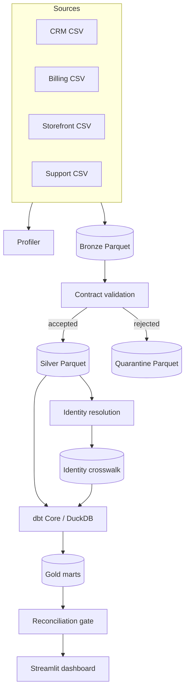

# Architecture and decisions

## Logical architecture

## ADR-001: DuckDB and Parquet

**Decision:** DuckDB is the embedded compute/catalog layer and Parquet is the durable analytical interchange. **Reason:** zero infrastructure, strong SQL, local portability, and visible storage boundaries. **Trade-off:** the project demonstrates production patterns, not distributed service operations.

## ADR-002: Split Python and dbt responsibilities

**Decision:** Python owns source simulation, file-level ingestion, validation, quarantine, and identity crosswalks. dbt owns dimensional and KPI SQL. **Reason:** each layer stays inspectable and testable in its natural tool.

## ADR-003: Deterministic rules-based identity

**Decision:** exact normalized email first, then exact normalized phone, then source-system key mapping; ambiguous collisions are not auto-merged. **Reason:** explainability and precision beat opaque recall in an onboarding proof of value.

## ADR-004: Optional Spark parity slice

**Decision:** Keep Spark outside the default dependency group and implement one representative order-standardization path. **Reason:** demonstrate API fluency without imposing a large Java/Spark runtime on every reviewer.

## ADR-005: Full rebuild by default

**Decision:** Each local run rebuilds generated layers atomically for its run ID. **Reason:** deterministic, small synthetic volumes make reproducibility more valuable than incremental complexity. Incremental design is documented as a production extension.
