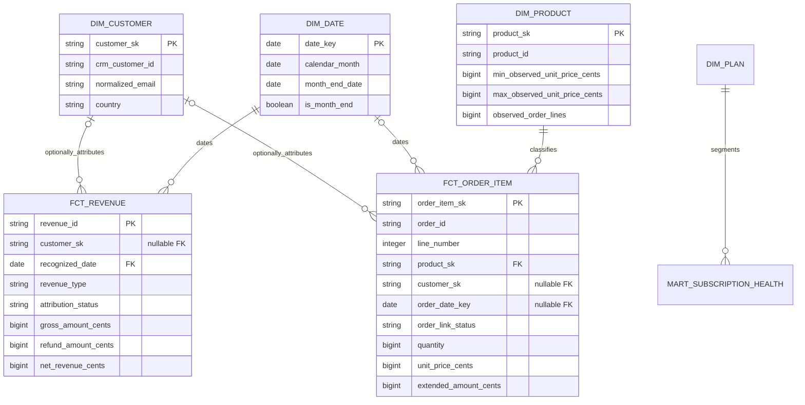

# Data model and lineage

Every model declares its grain in `dbt/models/schema.yml` and in a header comment on the model file. Staging models read governed dbt sources (`silver` and `quarantine`), so lineage is complete inside dbt and no model reaches around it with a raw file path.

## Layers

| Layer | Models | Grain |
|---|---|---|
| Staging | `stg_customers`, `stg_subscriptions`, `stg_invoices`, `stg_orders`, `stg_order_items`, `stg_tickets`, `stg_identity_crosswalk`, `stg_quarantined_order_items` | One row per accepted source record, plus one row per rejected order line |
| Dimensions | `dim_customer`, `dim_plan`, `dim_product`, `dim_date` | One row per canonical customer, governed plan, observed product, and calendar date |
| Facts | `fct_revenue`, `fct_order_item` | One row per recognized revenue transaction; one row per accepted order line |
| Marts | `mart_monthly_kpis`, `mart_subscription_health`, `mart_support_health`, `mart_order_line_integrity` | Month/type/currency; month/plan; month/category; accepted order |

## Declared semantics

Money uses integer minor units. Revenue remains separated by transaction currency; no invented FX conversion is performed. Every valid financial transaction remains in `fct_revenue`; unresolved identities have a null customer key and `attribution_status = 'unattributed'`. Company revenue includes both attribution states, while customer-level metrics use only attributed rows. The two partitions reconcile exactly at month, revenue type, and currency grain. Customer surrogate keys are deterministic hashes of normalized synthetic email. The identity crosswalk records source identity, canonical key, method, and confidence.

`dim_product` is derived from accepted order lines because Northstar Commerce supplies no product master extract. It publishes the observed unit-price range and line volume rather than asserting a list price it cannot source.

`dim_date` is generated from the earliest and latest dates observed in accepted invoices, orders, subscriptions, and tickets. No reporting window is hardcoded, and `mart_subscription_health` takes its month spine from this dimension.

`fct_order_item` keeps every accepted order line. A line whose parent order was quarantined carries `order_link_status = 'order_not_accepted'` with null order date, status, currency, and customer key, because the order context cannot be sourced without inventing it. In the current default run, 8 of 3,021 accepted lines are in that state, caused by the 6 quarantined order headers.

`mart_order_line_integrity` compares each accepted order header amount with its accepted line total and classifies the result:

| Status | Meaning |
|---|---|
| `complete` | Accepted lines sum exactly to the header amount |
| `incomplete_quarantined_line` | The difference coincides with a quarantined line on the same order |
| `incomplete_unexplained_line` | The difference has no order-scoped quarantine evidence, which happens when a rejected line lost its parent order id |

Quarantining a line item breaks order-total integrity, so that consequence is published rather than silently absorbed into a metric. The count of `incomplete_unexplained_line` orders can never exceed the number of lines quarantined under `ORDER_ITEM_ORPHAN`, and `line_variance_cents` can never be negative because accepted lines can go missing but are never invented.
