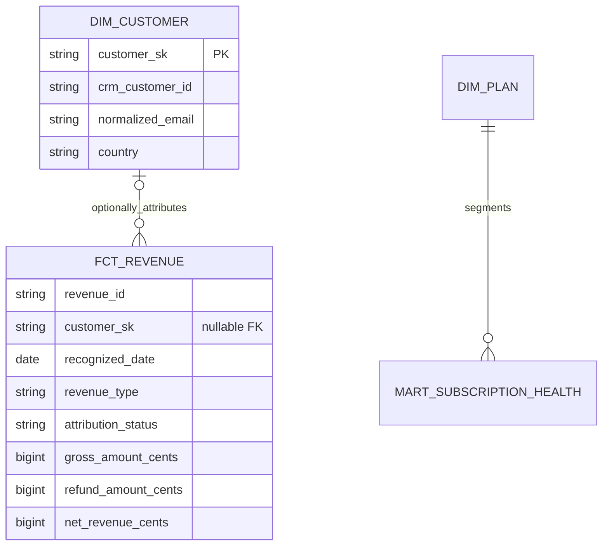

# Data model and lineage

Money uses integer minor units. Revenue remains separated by transaction currency; no invented FX conversion is performed. Every valid financial transaction remains in `fct_revenue`; unresolved identities have a null customer key and `attribution_status = 'unattributed'`. Company revenue includes both attribution states, while customer-level metrics use only attributed rows. The two partitions reconcile exactly at month, revenue type, and currency grain. Customer surrogate keys are deterministic hashes of normalized synthetic email. The identity crosswalk records source identity, canonical key, method, and confidence.
