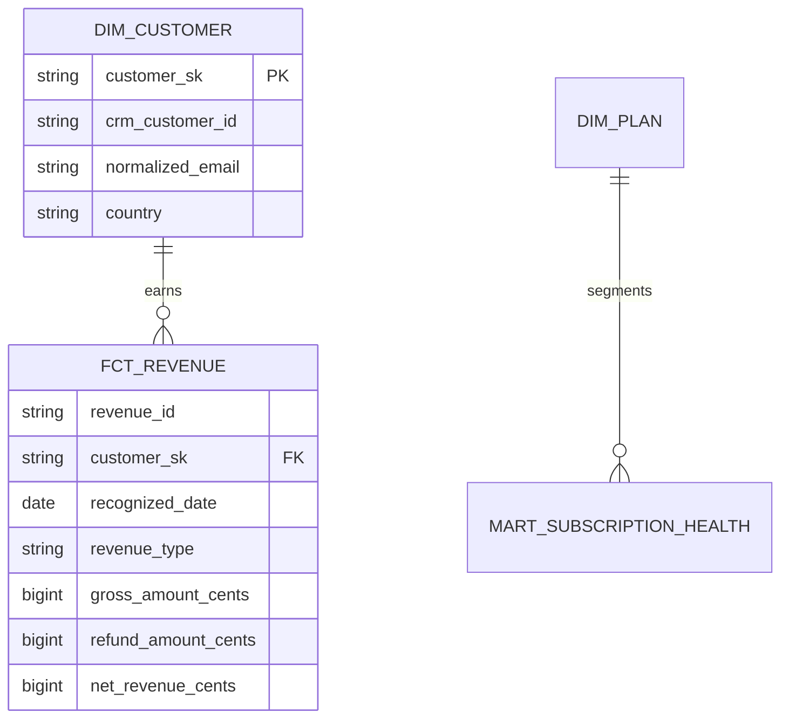

# Data model and lineage

Money uses integer minor units. Revenue remains separated by transaction currency; no invented FX conversion is performed. Customer surrogate keys are deterministic hashes of normalized synthetic email. The identity crosswalk records source identity, canonical key, method, and confidence.
