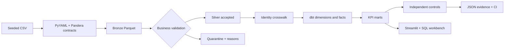

# Repository knowledge map

This is the shortest path from “I cloned the repository” to “I can explain and debug it.”

## What the system does

FieldForge generates six deterministic, deliberately imperfect operational extracts for fictional Northstar Commerce. It validates extract shape, preserves raw values and provenance in bronze, separates accepted and quarantined records in silver, resolves identities without guessing, builds a dimensional DuckDB warehouse with dbt, exports gold Parquet marts, independently reconstructs governed metrics, and exposes the evidence in Streamlit.



## Ownership by component

| Component | Owns | Does not own |
|---|---|---|
| `fieldforge/generate.py` | deterministic synthetic source creation | validation or KPI meaning |
| `fieldforge/contracts.py` | pre-bronze ordered/strict extract schemas | business-rule acceptance |
| `fieldforge/pipeline.py` | profiling, provenance, quarantine, standardization, identity | analytical marts |
| `dbt/models/` | typed staging, dimensions, facts, KPI marts, SQL lineage | independent release controls |
| `fieldforge/reconciliation.py` | source-independent KPI reconstruction | dashboard presentation |
| `dashboard/queries.py` | production display queries | metric definitions |
| `dashboard/app.py` | operational and business presentation | changing governed data |
| `dashboard/sql_lab.py` | temporary read-only investigation | writes or external access |
| `fieldforge/portfolio.py` | tool/evidence and reviewer-readiness contract | runtime data quality |

## Critical grains and keys

- Customer: one row per `customer_sk`.
- Subscription: one row per `subscription_id`.
- Revenue fact: one transaction per invoice or eligible order, with currency and attribution status.
- Order: one row per `order_id`; order item: one row per (`order_id`, `line_number`).
- Monthly revenue: calendar month × revenue type × currency.
- Subscription health: calendar month × plan.
- Support health: opening calendar month × category.

## Invariants worth defending

1. For every source, `bronze = accepted + quarantine`.
2. No valid money disappears because identity is unresolved.
3. Currency is never collapsed without an approved FX model.
4. Every attributed revenue row has a valid customer; every unattributed row has a null customer key.
5. All 3,021 accepted order lines stay visible, including eight whose parent header was rejected.
6. Dashboard numbers come from governed marts and retain direct query traceability.
7. Independent controls reconstruct results from accepted Parquet rather than trusting the marts they test.

## Failure diagnosis

| Symptom | First evidence | Likely boundary |
|---|---|---|
| Pipeline stops before bronze | `source_contract_validation.json` or Pandera error | missing, extra, or reordered source column |
| Row counts do not reconcile | `validation_summary.json` | silver/quarantine partition logic |
| dbt test fails | `dbt/target/run_results.json` | model grain, relationship, accepted values, or business SQL |
| KPI control fails | `reconciliation.json` | source-to-mart semantic disagreement |
| Dashboard fails | `fieldforge dashboard-check` then AppTest | warehouse freshness, query contract, or rendering |
| Tool claim fails | `portfolio_check.json` | missing evidence path, required document, or stale active state |
| Native/container differ | compare source hashes and isolated artifacts | platform, dependency, mount, or path configuration |

## Reviewer commands

```bash
make setup
make all
make portfolio-check
make dashboard
```

For the strongest local proof, install Java 17 and run `make setup-all && make verify`. For Linux parity, build and run the Compose pipeline with isolated data/artifact roots. Read the newest `ASTRA_WORKLOG.md` receipt before quoting counts, commits, or CI runs.

## Honest scope

The project proves a reproducible local/private onboarding implementation over synthetic data. It does not prove cloud deployment, production traffic, real-PII controls, high availability, distributed Spark operation, or an FX policy. Those are explicit next-stage engineering decisions, not hidden omissions.
